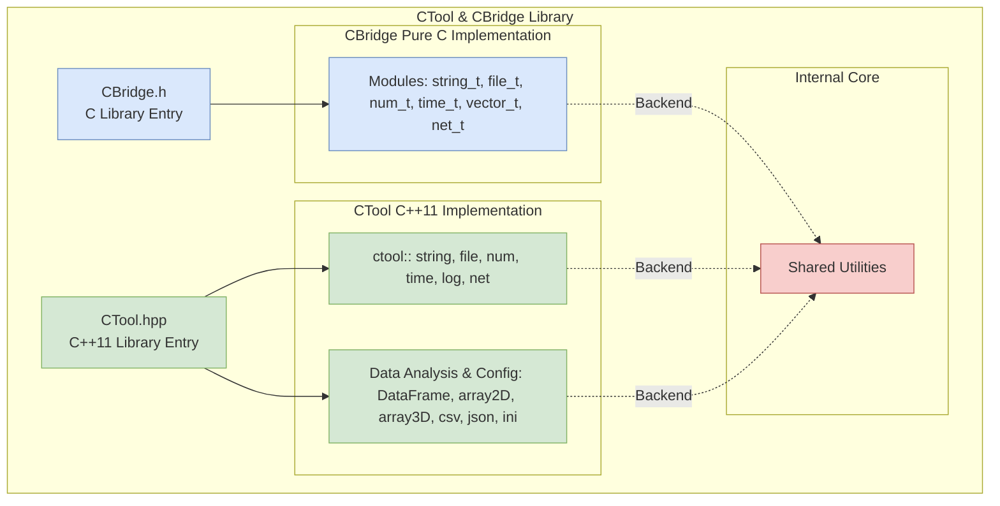

# CTool & CBridge Utility Library

**Author:** Florent ALBANY (FAL)  
**License:** Copyright (c) 2026  
**C++ Standard:** C++11 and above | **C Standard:** C99/C11

## Overview

**CTool** is a robust utility framework designed to streamline general software development in C and C++. It provides safe, platform-independent wrappers for common programming challenges, allowing developers to focus on logic rather than boilerplate code.

The project is structured into two distinct layers:
* **CBridge (`cbridge_*`)**: A pure C implementation using an object-oriented "Namespace" pattern.
* **CTool (`ctool::*`)**: A modern C++11 library utilizing the Standard Template Library (STL) and modern RAII principles.

---

## CTool & CBridge Architecture



## Features

- **Cross-Platform:** Native support for Windows (`_WIN32`) and Linux/Unix environments.
- **String Manipulation:** Advanced parsing, trimming, splitting, and recursive find-and-replace (C: `string_t`, C++: `ctool::str`).
- **Filesystem Management:** Safe I/O, directory traversal, and configuration (`.ini`) parsing.
- **Data Containers:** Generic dynamic vectors (C: `vector_t`) and efficient C++ templates.
- **Data Analysis:** Lightweight C++11 DataFrames, CSV/JSON parsers, and multi-dimensional arrays (`array2D`, `array3D`).
- **Networking:** Basic cross-platform socket wrappers (TCP/UDP).
- **System Utilities:** High-precision timing, thread-safe logging, and unit conversion.

## Directory Structure

```text
.
├── src/
│   ├── cbridge/       # CBridge: Pure C implementation modules
│   ├── ctool/         # CTool: C++11 implementation modules
│   ├── internal/      # Private core utilities and platform abstractions
│   ├── CBridge.h/c    # C entry point
│   └── CTool.hpp/cpp  # C++ entry point
├── docs/               # Comprehensive API documentation
├── examples/          # Usage examples and tutorials
├── tests/             # CTest-based testing suite
└── CMakeLists.txt     # Main build configuration
```

## Quick Start

### C++ Example (CTool)

```cpp
#include "CTool.hpp"

// Use the ctool namespace for convenience
using namespace ctool;

int main() {
    // String manipulation
    std::string clean_str = ctool::str::trim("  Hello CTool!  ");
    ctool::log::info("Cleaned string: {}", clean_str);

    // File system and INI parsing
    if (ctool::file::exists("config.ini")) {
        ctool::ini::IniFile config("config.ini");
        std::string app_name = config.get("General", "AppName", "DefaultApp");
        ctool::log::info("Application name from config: {}", app_name);
    } else {
        ctool::log::warn("config.ini not found, using defaults.");
    }

    // Time utilities
    long long current_time_ms = ctool::time::timestamp_ms();
    ctool::log::info("Current timestamp (ms): {}", current_time_ms);

    return 0;
}
```

### C Example (CBridge)

```c
#include "CBridge.h"
#include <stdio.h>

int main() {
    // String manipulation
    string_t* s = cbridge_string.create("Hello CBridge");
    cbridge_string.append(s, " from C!");
    printf("String: %s\n", cbridge_string.c_str(s));
    cbridge_string.free(s);

    // File operations
    if (cbridge_file.exists("data.txt")) {
        printf("data.txt exists.\n");
    } else {
        cbridge_file.write_text("data.txt", "Some data for CBridge.");
        printf("data.txt created.\n");
    }

    // Math functions
    printf("Pi: %f\n", cbridge_math.get_pi());

    // Network (simple placeholder)
    // Note: Actual network operations would require more setup.
    printf("Connecting to example.com (placeholder).\n");

    return 0;
}
```

## Documentation

For a full API reference and detailed module guides, visit the **[Documentation Hub](./docs/README.md)**.

### 🗂️ Documentation Reference
- [**Installation Guide**](INSTALL.md)
- [**DLL Usage Guide**](docs/dll_usage.md)
- [**Direct Source Guide**](docs/direct_source_usage.md)
- [**CBridge Documentation**](docs/cbridge/README.md)
- [**CTool Documentation**](docs/ctool/README.md)

## Contact

  - **Author:** Florent ALBANY (FAL)
